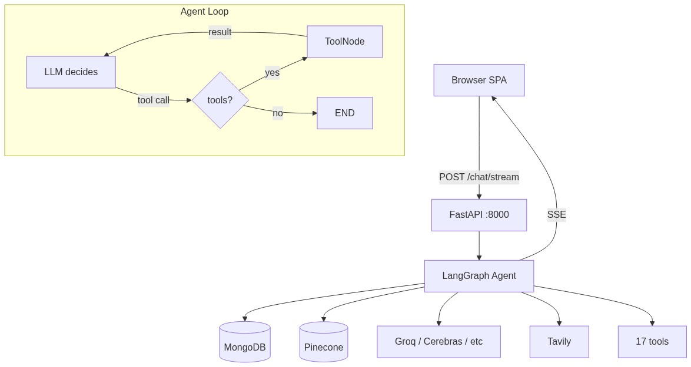
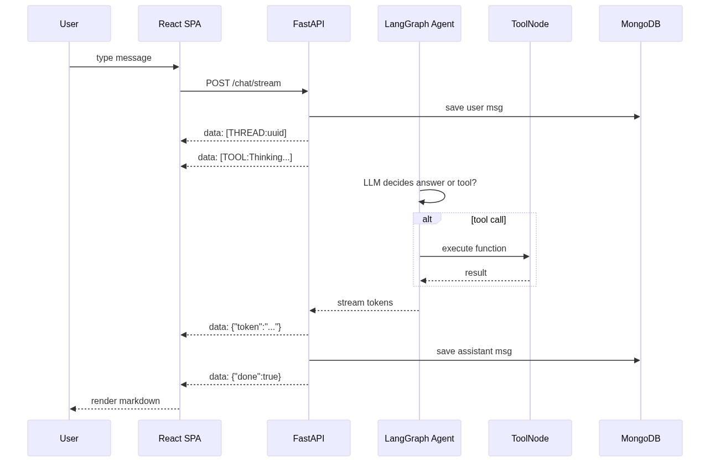

# AxioGPT
# LIVE URL AVAILABLE ON: https://axioai.vercel.app
Agentic AI assistant with web search, RAG over uploaded documents, memory, and multi-model support. Built on LangGraph, FastAPI, and React. Think of it as a customizable ChatGPT clone — but with tools and a real agent loop.

## Architecture overview



## What makes this different

**LangGraph agent loop** — the model can decide to call tools, get results, and continue the conversation. It's not a chatbot, it's an agent.

The agent has 19 tools available: web search, Wikipedia, YouTube transcripts, image generation (Pollinations.ai), stock prices, weather, current time, file operations, RAG search, and memory. It decides when to use them based on the conversation.

## Models

| Name | Provider | Why this one |
|------|----------|-------------|
| Llama 3.3 70B | Groq | Fast inference, generous free tier. Good default for most uses. |
| GPT OSS 120B | Cerebras | Surprisingly good for a small provider. Fast. |
| OpenRouter Auto | OpenRouter | Routes to the best available open model. Fallback king. |
| Nemotron 3 120B | NVIDIA | Optimized for agentic/tool-use workflows. |
| Gemini 2.5 Flash | Google Gemini | Free, good at vision and long context. |

## What I'd change if I started over

- **Pinecone or pgvector**: Pinecone is fine, but for a self-hosted setup I'd use pgvector with Supabase. 
- **MongoDB checkpointer**: LangGraph's `MongoDBSaver` works but adds latency on every streaming step. For production at scale, I'd look at the Postgres checkpointer.
- **SSE vs WebSockets**: SSE is simpler and works through most proxies. But if you need bidirectional communication (like mid-stream cancellation from the client), WebSockets are cleaner.
- **File uploads to S3**: Currently saves to local disk. Fine for Render + single instance, but for scale beyond one server, uploaded files will br moved to aws or cloudinary.

## Local development

### Backend

```bash
cd backend
python -m venv .venv
.venv\Scripts\activate     # Windows
# source .venv/bin/activate  # Linux/Mac
pip install -r requirements.txt
```

Copy `.env` (not committed, contains API keys). Required vars:

```
GROQ_API_KEY=
CEREBRAS_API_KEY=
OPENROUTER_API_KEY=
NVIDIA_API_KEY=
GEMINI_API_KEY=
TAVILY_API_KEY=
PINECONE_API_KEY=
MONGO_DB_URI=
OPENWEATHER_API_KEY=
DEFAULT_MODEL=models/gemini-2.5-flash
ALLOWED_ORIGINS=http://localhost:5173
```

Start:

```bash
uvicorn app:app --reload --port 8000
```

### Frontend

```bash
cd frontend
npm install
npm run dev
```

Set `VITE_API_URL=http://localhost:8000` if needed (defaults to localhost:8000).

The Vite dev server proxies `/models`, `/conversations`, `/history`, `/upload`, `/chat` to the backend. So you can just open `http://localhost:5173` and it works.

## Deployment

### Backend → Render
- **URL:** https://axiogpt-backend.onrender.com
- Runtime: Docker, root dir: `backend`, auto-deploys from `main`

### Frontend → Vercel
- **URL:** https://axioai.vercel.app
- Root dir: `frontend`, env: `VITE_API_URL=https://axiogpt-backend.onrender.com`

### Isolation
Conversations are scoped per browser via a UUID in localStorage — no login required, but users can't see each other's chats.

### Persistence
Uploaded files are stored in MongoDB (GridFS).

## API

Everything is at `backend/app.py`.

| Endpoint | Method | Description |
|----------|--------|-------------|
| `/` | GET | Health check |
| `/health` | GET | Health check (for Render) |
| `/models` | GET | List available models |
| `/conversations` | GET | List conversations (scoped to user via X-User-Id) |
| `/history/{thread_id}` | GET | Get messages for a thread |
| `/upload` | POST | Upload a file (PDF, DOCX, TXT, etc.) — 20/min |
| `/files/{file_id}` | GET | Download an uploaded file |
| `/chat/stream` | POST | Stream a chat response (SSE) — 30/min |

### `/chat/stream` request

```json
{
  "message": "search the web for AI news",
  "thread_id": null,
  "model": "llama-3.3-70b-versatile"
}
```

Leave `thread_id` null for new conversations. The server creates one and sends it back as `data: [THREAD:uuid]\n\n`.

### SSE response format

```
data: {"token":"Hello"}

data: {"token":" world"}

data: [TOOL:Thinking...]

data: {"done":true}
```

Error format:

```
data: {"error":"Something went wrong"}
data: {"done":true}
```

## Project structure

```
├── backend/
│   ├── app.py           # FastAPI server, SSE streaming, routes
│   ├── agent.py         # LangGraph agent definition, model config, graph compilation
│   ├── tools.py         # 19 tool definitions (web search, calc, RAG, memory, etc.)
│   ├── database.py      # MongoDB CRUD for conversations, messages, long-term memory
│   ├── rag.py           # Pinecone vector search with Gemini embeddings
│   ├── requirements.txt
│   ├── Dockerfile
│   └── Procfile
├── frontend/
│   ├── src/
│   │   ├── api/client.js              # HTTP client, 5 API functions
│   │   ├── context/ChatContext.jsx     # Global state (useReducer), SSE reader loop
│   │   ├── components/
│   │   │   ├── InputBar/InputBar.jsx   # Text input, voice, drag-and-drop upload
│   │   │   ├── MessageBubble/MessageBubble.jsx  # Markdown renderer with syntax highlighting
│   │   │   ├── Sidebar/Sidebar.jsx     # Conversation list grouped by date
│   │   │   ├── Topbar/Topbar.jsx       # Model selector dropdown
│   │   │   ├── ChatWindow/ChatWindow.jsx  # Message list + tool activity toast
│   │   │   └── EmptyState/EmptyState.jsx  # Welcome screen with starter prompts
│   │   ├── App.jsx
│   │   ├── main.jsx
│   │   └── index.css
│   ├── vite.config.js
│   ├── package.json
│   ├── Dockerfile
│   └── nginx.conf
├── .github/workflows/main.yml   # CI — Python check + frontend build
├── docker-compose.yml
├── vercel.json
└── .gitignore
```

## The agent loop (how it works)



The LLM gets the system prompt and chat history. It can return tool calls (JSON function-calling format). LangGraph's `tools_condition` routes tool calls to the `ToolNode`, which executes them and feeds results back to the LLM. This loops until the LLM decides to respond directly.

The checkpointer (`MongoDBSaver`) saves state at every step, so you can resume conversations across restarts.

